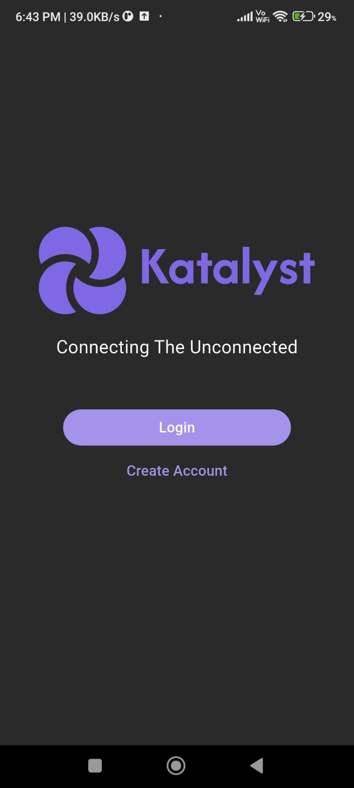
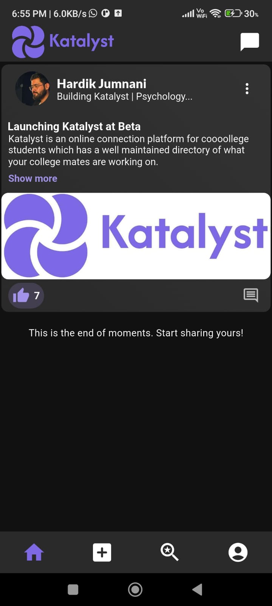
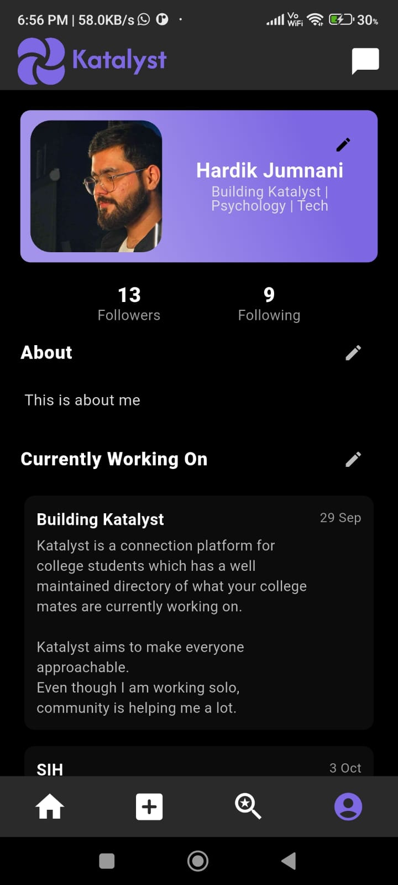
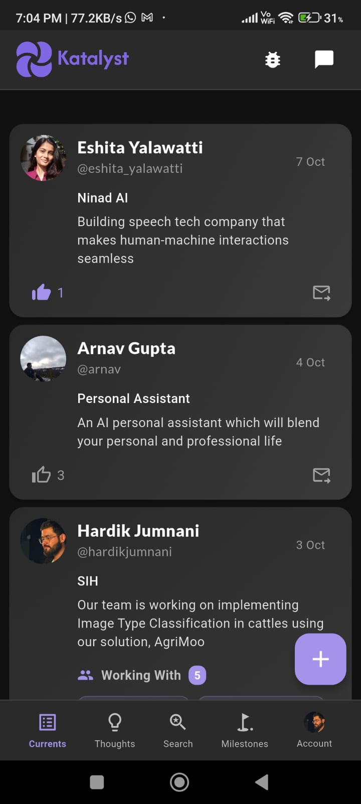
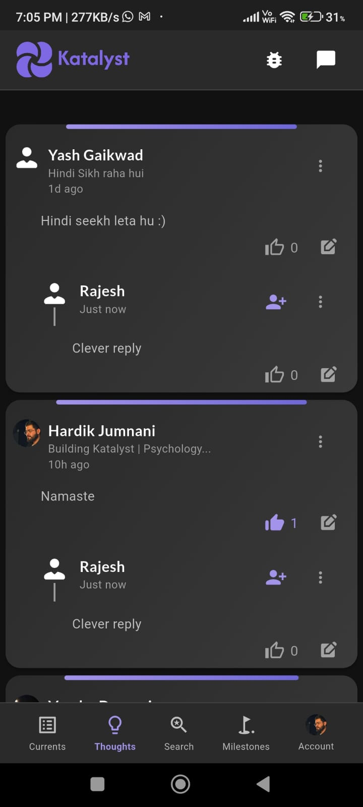
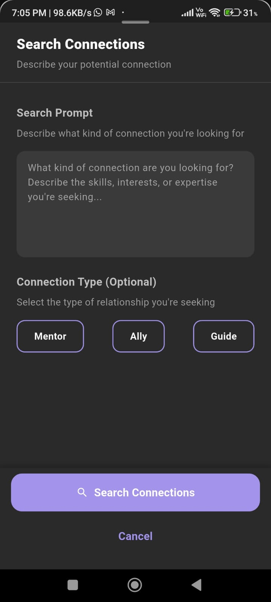
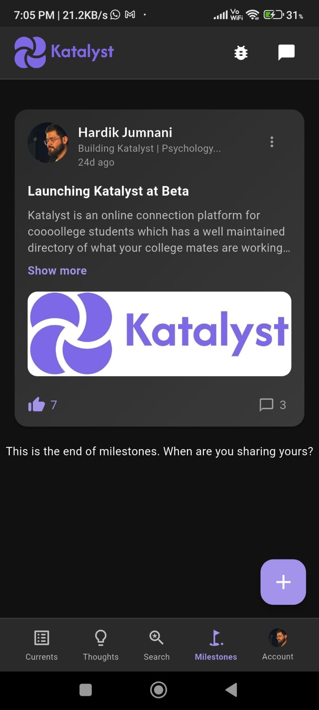
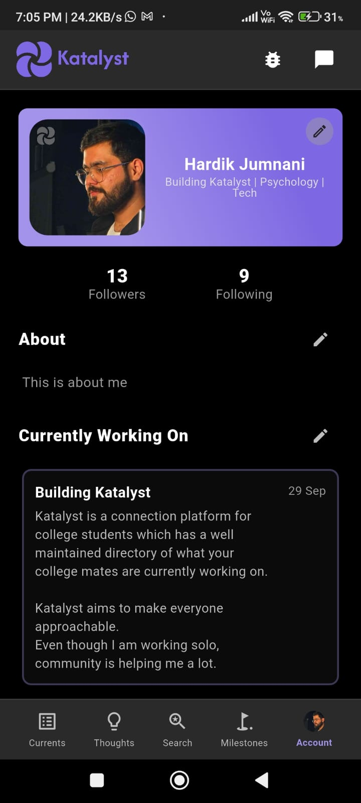
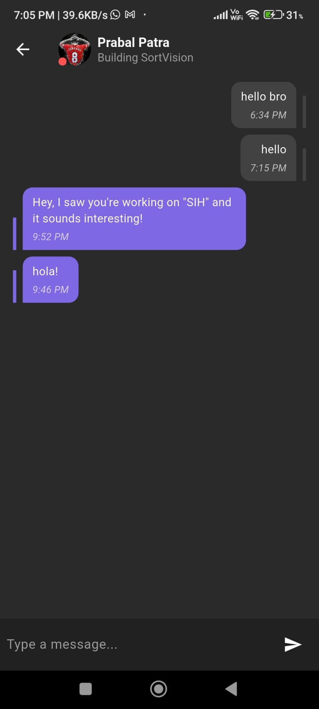

# Katalyst (project name: shakala)

Katalyst is an online connection platform for college students which has a well maintained directory of what their college mates are currently working on. 

We help you find people which are doing things that interests you. 
Not only that, our USP lies in giving you the freedom to define your interests and find the right match. 

Instead of committing to do a post, which would stay on your profile, we have given you two ways to open up and grow... 
1. You can share what you are currently working on, which you can remove and replace once you are working on a new idea. 
2. You can share milestones which are your achievements in your journey to your goals. It not only stays in your profile but highlights it and gets support from your mates. 

At Katalyst, we understand that if someone has connections based on their interest, they soon get into a bubble, which is valuable only till an extend. 
Therefore, the Katalyst algorithm suggests you people who are both easy to connect and are further than your connection circle, so that you can connect faster, better, wider. 

Katalyst aims to make everyone approachable, for you.

---

---  
(Latest version of Katalyst whose code is not public)
   

